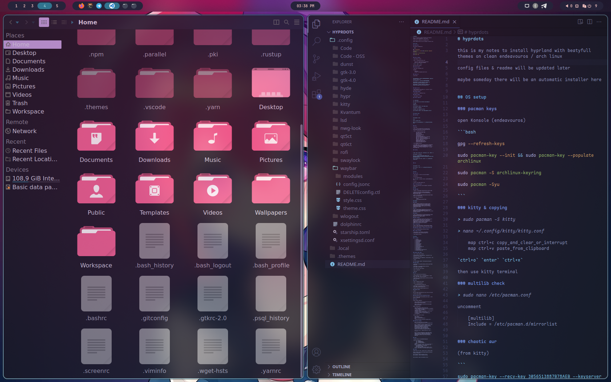

# Arch + Hyprland Tutorial

[Video Preview](https://mega.nz/file/BZlFiZzS#LSdctfZS23Rrj86vcrjySqEcBuJNBAH4TuntJG4nH90)

Tutorial on how to install Arch and configure the desktop environment yourself

# Content

> 1_OS_Install.md

> 2_Pacman_Setup.md

> 3_Terminal_Setup.md

> 4_Top_Menu_And_Themes.md

> 5_Additional_Desktop.md

> 6_Software.md

